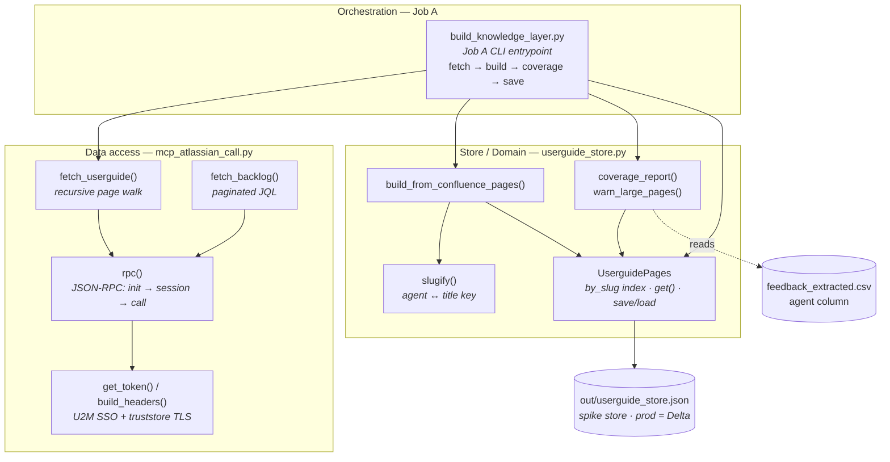
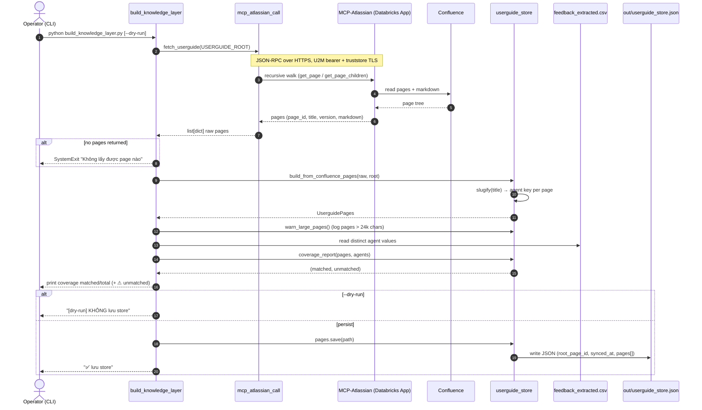
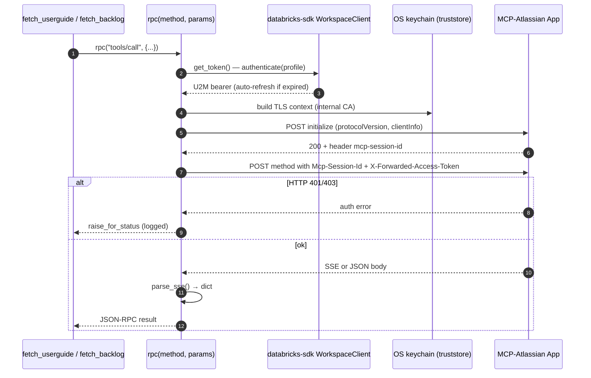
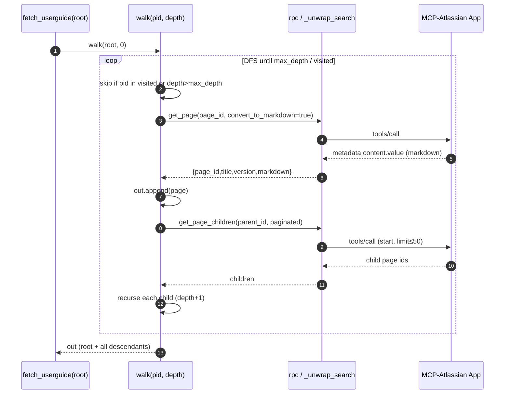
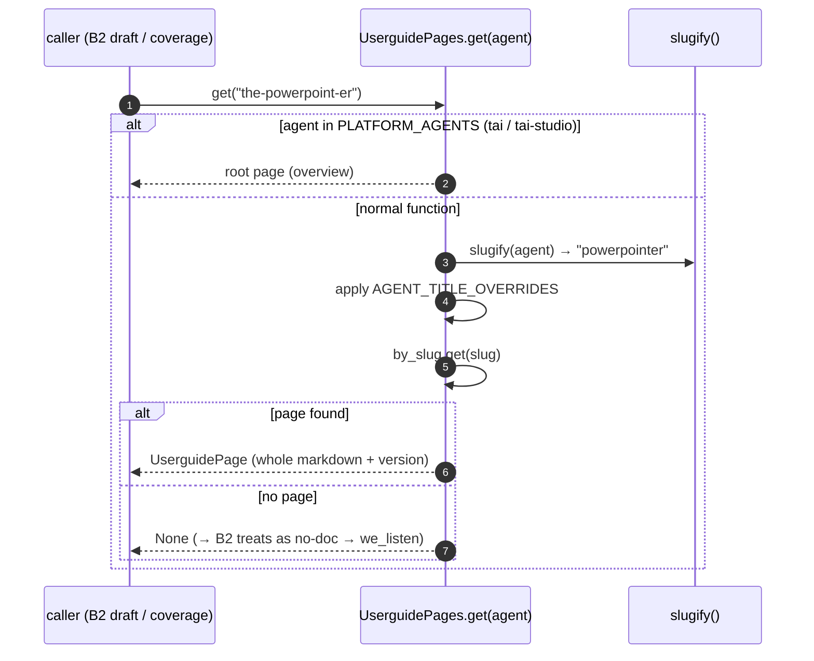
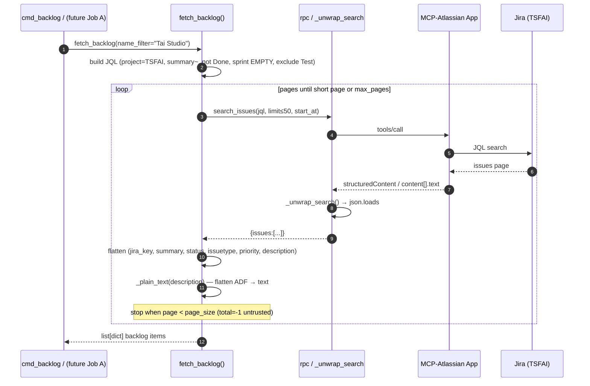
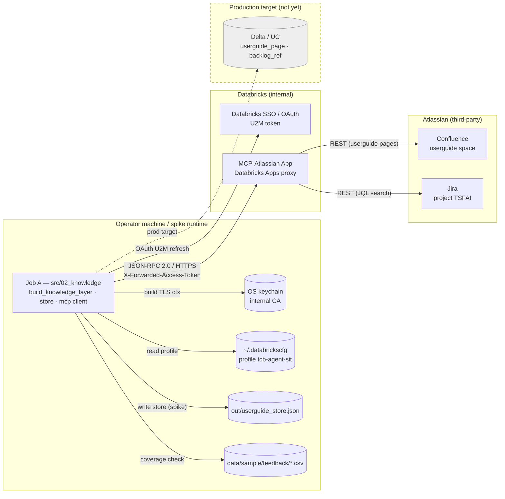

# Knowledge Layer (`src/02_knowledge`) — Architecture

The knowledge layer is the **`ingest-sync` module (Job A)** of the Auto User Feedback system. Its responsibility is to pull product documentation from Atlassian and turn it into a lookup store the inference job (B2 `draft`) can read at answer time:

- **Userguide (Confluence)** → fetched whole and stored as `userguide_page`, keyed by `agent` (function name). **No chunk / embed / vector index** (decision v3.1). Routing feedback → doc is a *table lookup on `agent`*, not semantic retrieval.
- **Jira backlog (`known_gap`)** → fetched as a flat issue list (`fetch_backlog`) for the `backlog_ref` store. Per v3.2 the backlog is also *whole-set → LLM* (no cosine/embedding).

All access to Atlassian goes through a single **MCP-Atlassian** server hosted on **Databricks Apps** (JSON-RPC 2.0 over HTTPS), authenticated with a **U2M SSO** bearer token. This is a **spike**: the store persists to a local JSON file (prod target = Delta table `userguide_page` / `backlog_ref`), and auth uses a personal U2M token instead of the production Azure AD service principal.

> Scope boundary: this doc covers only `src/02_knowledge` (Job A / the store). Consuming the store (B2 `answer_from_userguide`, backlog matching, citations) lives in the inference module and is out of scope here. The former `scholar_test.py` (Scholar managed-RAG, v3.0) was **removed** in the v3.1 cleanup — whole-page routing replaced it — so it no longer appears in these diagrams.

Architecture references: `docs/architecture.md` §3 (KNOWLEDGE LAYER + module table), §4.5 (`userguide_page`, `backlog_ref`), §5 (stack); `docs/2026-08-26/knowledge-retrieval-strategy/plan.md` (v3.1); `docs/2026-08-27/knowledge-layer-batch/plan.md` (v3.2).

---

## Component Diagram (High-Level Layers)

**What it shows.** Three live layers. The orchestrator `build_knowledge_layer.py` (Job A) is the only entrypoint: it calls `fetch_userguide()` in the **data-access** layer to pull pages via MCP, hands the raw pages to `build_from_confluence_pages()` in the **store** layer, checks coverage against the feedback CSV, then persists `UserguidePages` to JSON. `slugify()` is the shared key function that maps an `agent` value to a page title. `fetch_backlog()` exists in the access layer and is fully working, but is **not yet wired into Job A's store build** — it is exercised today only via the CLI (`backlog` command). *(The legacy `scholar_test.py` Scholar-App path was removed in the v3.1 cleanup — the whole-page routing store replaces it.)*

---

## Sequence Diagrams

### Full Flow — `build_knowledge_layer.py` builds the userguide store

**What it shows.** The end-to-end Job A run. Follow the path: fetch the whole userguide tree via MCP → derive an `agent` key per page from its title (`slugify`) → build the in-memory `UserguidePages` index → warn on oversized pages (token guard) → cross-check every distinct `agent` in the feedback CSV can be routed to a page (the **K-1 acceptance** check) → and finally persist to JSON unless `--dry-run`. Two guard branches matter: an empty fetch aborts the run, and `--dry-run` prints coverage without writing — the intended way to measure page sizes before committing a store.

### Feature — MCP JSON-RPC round trip (`rpc`)

**What it shows.** Every Atlassian call funnels through `rpc()`, which does a two-hop MCP handshake: `initialize` to obtain an `mcp-session-id`, then the actual `tools/call` carrying that session id plus the forwarded U2M token as the Atlassian identity. Non-obvious details: the bearer is fetched fresh from the Databricks SDK each call (auto-refreshing an expired SSO token), the TLS context is built from the OS keychain via `truststore` to survive the corporate MITM CA, and the response may arrive as Server-Sent-Events (`data: {...}`) so `parse_sse()` normalizes both SSE and plain JSON. 401/403 are logged before raising.

### Feature — Recursive userguide walk (`fetch_userguide`)

**What it shows.** How the whole userguide tree is collected. `walk()` is a depth-first traversal guarded by a `visited` set (loop protection) and `max_depth`. For each page it fetches the markdown (`get_page`, unwrapped from `metadata.content.value` by `_unwrap_search`) and then lists direct children with pagination (server caps `limit` at 50; the pager stops when a short page returns). The result is a flat list of `{page_id, title, version, markdown}` — the exact input `build_from_confluence_pages` expects.

### Feature — `agent → page` routing (store lookup)

**What it shows.** The core v3.1 idea: routing is a normalized dictionary lookup, not a search. `slugify()` strips accents/case/non-alphanumerics and the leading `the`, so `the-powerpoint-er`, `The PowerPoint-er` and page title `PowerPointer` all collapse to the same key. Platform-level agents (`tai`, `tai-studio`) short-circuit to the root/overview page; anything unmatched deliberately returns `None` rather than guessing a wrong page — the caller (B2) reads `None` as "no documentation" and falls back to `we_listen`. This same `get()` powers `coverage_report()`, which is how Job A proves K-1 (every feedback `agent` is routable).

### Feature — Jira backlog fetch (`fetch_backlog`) — *available, not yet in Job A store*

**What it shows.** The backlog side of the access layer. `fetch_backlog` builds a JQL filter (project `TSFAI`, `summary ~ "Tai Studio"`, not Done, `sprint is EMPTY`, excluding auto-generated `Test` issues) and self-paginates — it does **not** trust the server's `total` (always `-1`), instead stopping when a page returns fewer rows than requested, bounded by `max_pages`. Each issue is flattened, and `_plain_text()` recursively collapses Atlassian ADF description nodes into plain text. **Non-obvious status:** this function is complete and CLI-exercisable today, but Job A (`build_knowledge_layer.py`) does **not** call it — persisting `backlog_ref` is still an open gap (see Open Questions).

---

## Integration Diagram (Environment)

**What it shows.** The trust boundaries around Job A. Locally it reads the Databricks profile and the OS keychain (for the internal-CA TLS context), and writes the spike JSON store plus reads the feedback CSV. It authenticates against **Databricks SSO** (U2M OAuth, auto-refresh) and makes all documentation calls to the **MCP-Atlassian App** — a Databricks-hosted proxy — over JSON-RPC/HTTPS, forwarding the user token as the Atlassian identity. The App is the only component that talks to **Confluence** and **Jira** directly (third-party trust zone). The dashed edge is an intentional non-fact: the **Delta/UC** store is the production target not yet implemented.

---

## Open Questions / Assumptions

- **`backlog_ref` persistence is not wired into Job A.** `fetch_backlog()` works and is CLI-reachable, but `build_knowledge_layer.py` only builds/saves the userguide store. Whether Job A should also snapshot `backlog_ref`, or backlog is fetched live in the inference pipeline (v3.2 batch), is unresolved in this module's code. *(grounded: no `fetch_backlog` call in `build_knowledge_layer.py`.)*
- **Spike vs production divergence (deliberate).** Store = local JSON (not Delta `userguide_page`); auth = personal U2M token (not the §5 Azure AD service principal); transport = MCP-Atlassian (not the §5 production Jira REST + service principal). Documented as an intentional architecture deviation in the module docstrings.
- **`AGENT_TITLE_OVERRIDES` is empty.** The override map for cases where a page title doesn't slug-match its `agent` is a placeholder; coverage against the real Confluence space will show whether any overrides are needed. *(assumed: none needed until K-1 run reports unmatched agents.)*
- **`scholar_test.py` removed.** The legacy v3.0 Scholar managed-RAG path was deleted on 2026-08-27 (dead code — no live importer; replaced by the v3.1 whole-page routing store). It survives only as history in git and in the description above.
- **Page size / token budget.** `warn_large_pages` flags pages > 24k chars but the whole-page-into-LLM strategy has no hard cap yet; the plan's H2-heading pre-filter (plan §6) is a fallback that is not implemented.
